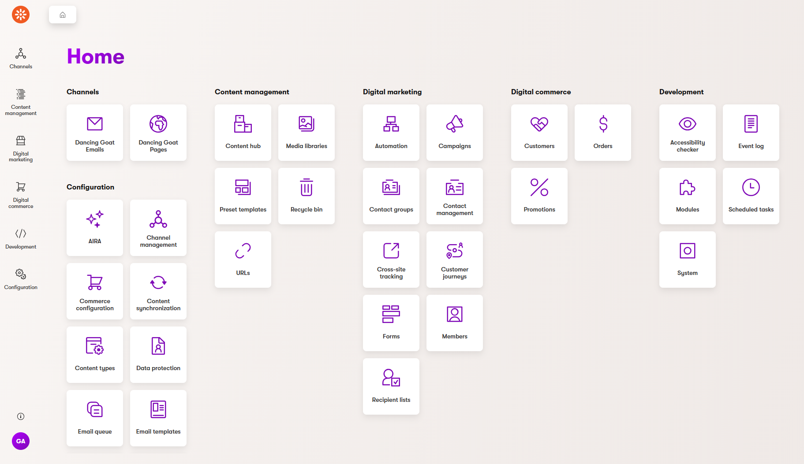
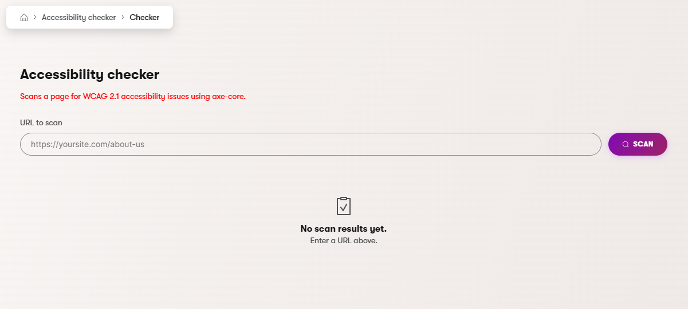
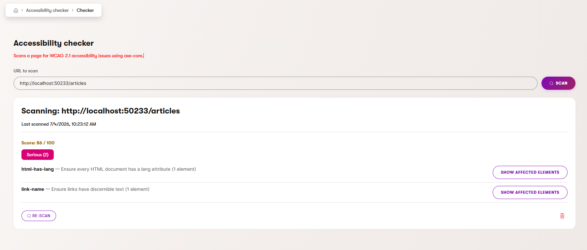

# Xperience by Kentico: Accessibility Checker

Adds an **Accessibility checker** application to the Xperience by Kentico admin UI. Paste the URL
of any page — including a page you're still developing locally — and get a WCAG 2.1 scan powered
by [axe-core](https://github.com/dequelabs/axe-core), run server-side against a real, fully
rendered copy of the page (via a headless Chromium browser), right from inside the admin you
already use every day.

## What it looks like

Once installed, an **Accessibility checker** tile appears in the admin's **Development** section,
alongside things like Modules and Scheduled tasks:



Opening it shows a URL field and an empty state until you run your first scan:



After scanning, each URL gets its own result card. Cards stack up (newest on top) so you can build
up a running list of pages you're auditing, and every card survives page reloads and switching
admin tabs — results are saved automatically, not just kept in the browser tab:



### What each part of a result card does

- **Score** — a 0–100 score for that page, weighted more heavily against critical and serious
  issues than minor ones. Green/amber/red colored depending on how high it is.
- **Severity groups** (`Critical` / `Serious` / `Moderate` / `Minor`) — every WCAG rule the page
  failed, grouped by how serious axe-core considers it, with a count badge. Only groups with
  issues are shown.
- **Show affected elements** — each rule lists a short summary (e.g. "20 images missing alt
  text") instead of one row per broken element, to keep the report readable. Click this to expand
  the full list of CSS selectors for every element that failed that specific rule, so you know
  exactly what to go fix.
- **Re-scan** — runs the scan again for that same URL and updates the card in place (the score and
  issue list refresh, the card doesn't move or duplicate). This is the normal workflow: scan a
  page, see an issue, fix it in your code, click **Re-scan** on the same card, and watch the score
  improve.
- **Delete** (the bin icon, bottom-right of the card) — permanently removes that result. Use it to
  clear out pages you're no longer tracking.

### Scanning your own local site

The **Scan** button works against any URL you paste in, including `http://localhost:<port>/...` —
but only while the admin application itself is running in a `Development` environment. This lets
you audit a site you're actively building before it's ever deployed. If the admin is deployed to
Production or Staging, scanning localhost/internal-network addresses is blocked by design (a
safeguard against the server being tricked into probing its own internal network) — that's
expected behavior, not a bug, if you notice it stop working after deploying.

## Requirements

### Library Version Matrix

| Xperience Version | Library Version |
| ------------------ | --------------- |
| >= 31.5.4           | 1.3.1           |

### Dependencies

- [ASP.NET Core 8.0](https://dotnet.microsoft.com/en-us/download)
- [Xperience by Kentico](https://docs.kentico.com)
- [Microsoft.Playwright](https://playwright.dev/dotnet/) (added automatically as a package
  dependency)

### Other requirements

- **A headless Chromium browser** is required to render pages for scanning, but you don't need to
  install it yourself. The first time you click **Scan**, if Chromium isn't present yet on that
  machine, it's downloaded automatically (a one-time, ~180MB download that takes roughly a minute)
  and the scan completes once it's ready. Every scan after that is instant, and this only happens
  once per machine/deployment target.
- No database setup is required. The scan history table is created automatically the first time
  the feature is used, in the same database your Xperience application already uses.

## Package Installation

Add the package to your application using the .NET CLI:

```powershell
dotnet add package XperienceCommunity.AccessibilityChecker
```

Then register the feature's services in `Program.cs`, before `builder.Build()`:

```csharp
builder.Services.AddAccessibilityChecker();
```

That's the only code change needed — the admin application tile, page, and API routes register
themselves automatically once the package is referenced.

## Quick Start

1. `dotnet add package XperienceCommunity.AccessibilityChecker`
2. Add `builder.Services.AddAccessibilityChecker();` in `Program.cs`
3. Run the application, open the admin, and find **Accessibility checker** under **Development**
4. Paste a URL and click **Scan** — the first scan on a new machine takes a bit longer while
   Chromium downloads automatically in the background; every scan after that is fast

## Full Instructions

View the [Usage Guide](./docs/Usage-Guide.md) for more detailed instructions.

## Contributing

To see the guidelines for Contributing to Kentico open source software, please see [Kentico's `CONTRIBUTING.md`](https://github.com/Kentico/.github/blob/main/CONTRIBUTING.md) for more information and follow the [Kentico's `CODE_OF_CONDUCT`](https://github.com/Kentico/.github/blob/main/CODE_OF_CONDUCT.md).

Instructions and technical details for contributing to **this** project can be found in [Contributing Setup](./docs/Contributing-Setup.md).

## License

Distributed under the MIT License. See [`LICENSE.md`](./LICENSE.md) for more information.

## Support

This is a community-maintained project, not an official Kentico product. It's provided as-is, with
support on a best-effort basis via [GitHub Issues](https://github.com/yashjangid22/Kentico.Community.AccessibilityChecker/issues).
